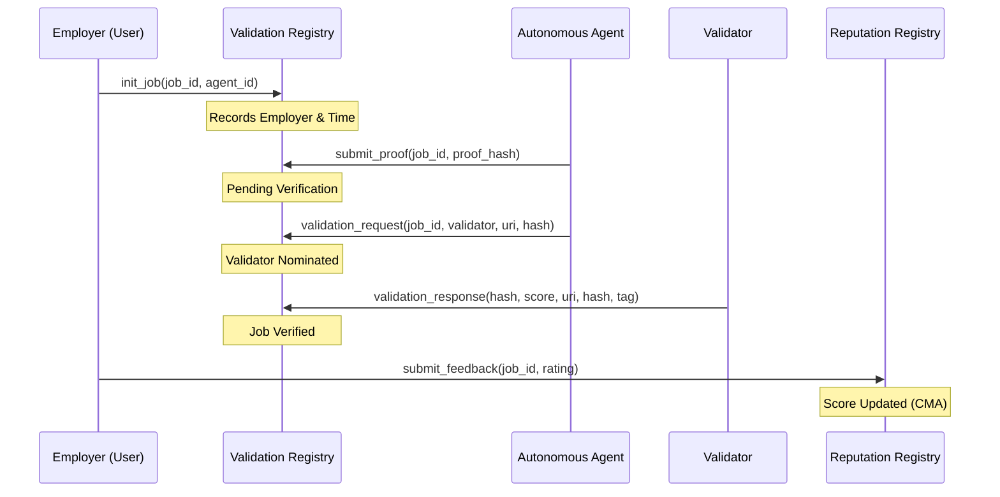

# MX-8004: Trustless Agents Standard (MultiversX)

[](https://opensource.org/licenses/MIT)
[](https://multiversx.com)

A protocol standard for **Trustless Agents** on MultiversX. Three smart contracts provide soulbound NFT identities, on-chain job validation with oracle verification, and anti-gaming reputation scoring — all connected via cross-contract storage reads (no async calls).

## Architecture

| Registry | Role |
|---|---|
| **Identity Registry** | Issues soulbound NFTs as agent identities. Stores metadata (name, URI, public key) in NFT attributes and mirrors service configs in contract storage for cross-contract reads. |
| **Validation Registry** | Records jobs, accepts proof submissions, and verifies completion via an oracle. Serves as the source of truth for employer-agent-job relationships. |
| **Reputation Registry** | Collects feedback gated by authorization and verified job completion. Cross-references both Identity and Validation registries to prevent Sybil attacks and frontrunning. |

## Protocol Flow



## Quick Start

```bash
git clone https://github.com/sasurobert/mx-8004.git
cd mx-8004
chmod +x setup.sh && ./setup.sh
```

The setup script installs the WASM target, `sc-meta` (if missing), builds all contracts, and runs tests.

### Prerequisites

| Tool | Version | Required |
|------|---------|----------|
| Rust | 1.78+ | Yes |
| `wasm32-unknown-unknown` | — | Auto-installed by setup.sh |
| `multiversx-sc-meta` | latest | Auto-installed by setup.sh |
| Docker | — | For chain simulator tests |

### Make Commands

```bash
make build              # Build all contracts (sc-meta all build)
make test               # Run unit & scenario tests
make coverage           # Generate LCOV coverage report
make coverage-html      # Generate HTML coverage report
make coverage-summary   # Print coverage summary to terminal
```

### Chain Simulator

Requires Docker. Spins up a local MultiversX chain for integration testing.

```bash
make cs-install         # Install the chain simulator
make cs-start           # Start the simulator (background)
make cs-test            # Run chain simulator tests
make cs-stop            # Stop the simulator
```

### CI Pipelines

```bash
make ci                 # build + test + coverage
make ci-full            # build + test + coverage + chain simulator tests
```

## Project Structure

```
mx-8004/
  common/                  # Shared types and structs
  identity-registry/       # Identity NFT contract
  validation-registry/     # Job validation contract
  reputation-registry/     # Reputation scoring contract
  proxies/                 # Auto-generated contract proxies
  tests/                   # Integration & chain simulator tests
  docs/                    # Specification and plans
```

## Specification

See [docs/specification.md](docs/specification.md) for the full protocol specification.

## License

This project is licensed under the MIT License — see the [LICENSE](LICENSE) file for details.
