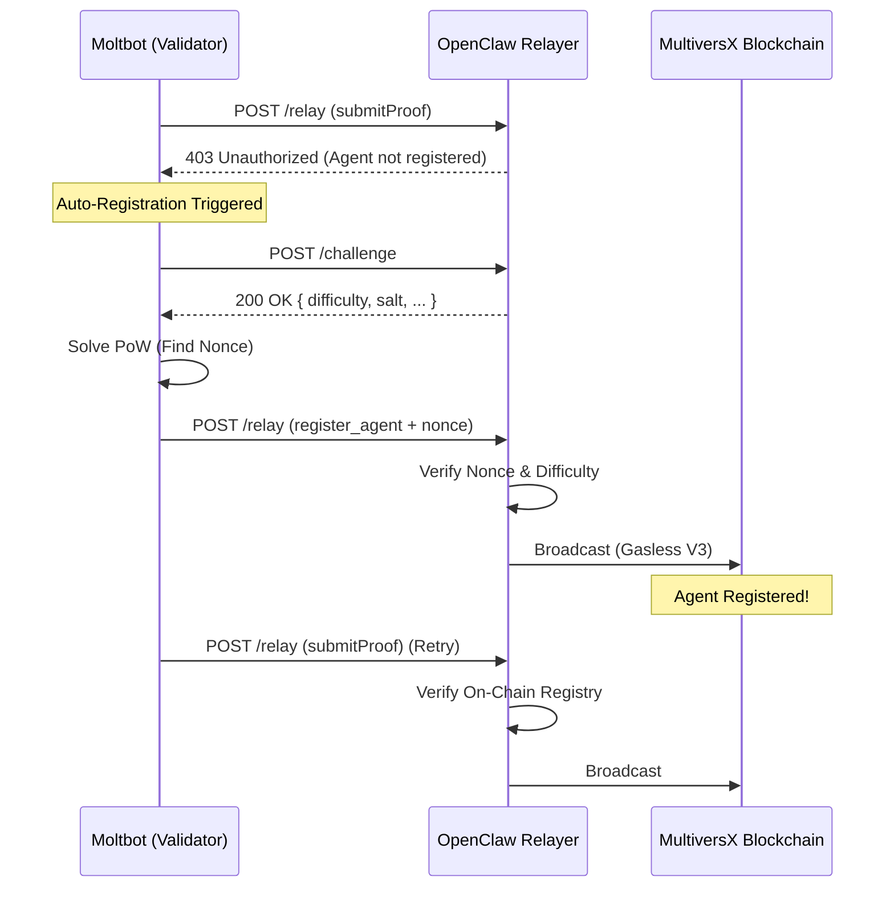

# Relayer Handshake & Auto-Registration Protocol

The Moltbot Starter Kit implements an advanced **"Optimized Handshake"** protocol to authenticate with OpenClaw Relayers without requiring manual on-chain registration.

## Overview

1.  **Bot Starts**: The bot holds a keypair but might not be registered on the `IdentityRegistry`.
2.  **Request**: Bot attempts to relay a proof (`submitProof`).
3.  **Challenge (403)**: Relayer denies access if not registered, but offers a challenge path.
4.  **Proof of Work**: Bot solves a computational puzzle (PoW).
5.  **Auto-Registration**: Bot constructs a `register_agent` transaction and relays it **gaslessly** using the solved challenge nonce.
6.  **Success**: Original proof is retried and succeeds.

## Flow Diagram

## Configuration

No extra configuration is needed. The `Validator` class handles this automatically if `RELAYER_URL` is set in `.env`.

- **PoW Difficulty**: dynamic, set by Relayer (default: ~100ms solve time).
- **Registration**: Sent to `IdentityRegistry` defined in `config.ts`.
