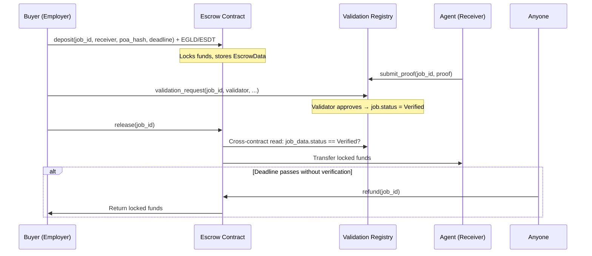

# ACP Escrow Contract — Technical Specification

## 1. Overview

The **ACP (Agent Commerce Protocol) Escrow Contract** is a trustless intermediary that locks funds during the lifecycle of an agent job. It ensures that:

- **Buyers (Employers)** can safely commit funds before an agent performs work
- **Agents (Receivers)** are guaranteed payment once their work is verified
- **Refunds** are automatic if the agent fails to deliver before a deadline

The escrow contract integrates with the existing MX-8004 registry stack via cross-contract storage reads, specifically with the **Validation Registry** to gate fund release on job verification status.

---

## 2. Architecture



### Contract Dependencies

| Contract | Relationship | Mechanism |
|:---|:---|:---|
| **Validation Registry** | Read job verification status | `storage_mapper_from_address("jobData")` |
| **Identity Registry** | Reference (stored at init, not yet used) | Future: agent identity checks |

### Storage Layout

| Mapper | Key | Value | Type |
|:---|:---|:---|:---|
| `escrowData` | `ManagedBuffer` (job_id) | `EscrowData<M>` | `SingleValueMapper` |
| `validationContractAddress` | — | `ManagedAddress` | `SingleValueMapper` |
| `identityContractAddress` | — | `ManagedAddress` | `SingleValueMapper` |

---

## 3. Data Structures

### EscrowStatus (Enum)
```rust
pub enum EscrowStatus {
    Active,    // Funds locked, job in progress
    Released,  // Funds transferred to receiver (job verified)
    Refunded,  // Funds returned to employer (deadline passed)
}
```

### EscrowData (Struct)
```rust
pub struct EscrowData<M: ManagedTypeApi> {
    pub employer: ManagedAddress<M>,       // Who deposited the funds
    pub receiver: ManagedAddress<M>,       // Who receives on release (agent)
    pub token_id: EgldOrEsdtTokenIdentifier<M>, // EGLD or ESDT token
    pub token_nonce: u64,                  // SFT/NFT nonce (0 for fungible)
    pub amount: BigUint<M>,               // Locked amount
    pub poa_hash: ManagedBuffer<M>,       // Proof-of-Agreement hash
    pub deadline: u64,                     // Unix timestamp (seconds)
    pub status: EscrowStatus,             // Current state
}
```

---

## 4. Endpoints

### 4.1 `init(validation_contract_address, identity_contract_address)`

| Property | Value |
|:---|:---|
| **Annotation** | `#[init]` |
| **Access** | Deployer only (at deploy time) |
| **Input** | Two `ManagedAddress` values |
| **Effect** | Stores contract addresses in storage |

### 4.2 `deposit(job_id, receiver, poa_hash, deadline)` — **Payable**

| Property | Value |
|:---|:---|
| **Annotation** | `#[payable("*")]`, `#[endpoint(deposit)]` |
| **Access** | Anyone (the caller becomes the employer) |
| **Input** | `job_id: ManagedBuffer`, `receiver: ManagedAddress`, `poa_hash: ManagedBuffer`, `deadline: u64` |
| **Payment** | EGLD or any single ESDT (amount > 0 required) |
| **Checks** | (1) Amount > 0, (2) No existing escrow for this job_id |
| **Effects** | Creates `EscrowData` with `Status::Active`, stores in `escrowData` mapper |
| **Events** | `escrow_deposited(job_id, employer, amount)` |

**Error Paths:**
- `ERR_ZERO_DEPOSIT` — Payment amount is 0
- `ERR_ESCROW_ALREADY_EXISTS` — Escrow already exists for this job_id

### 4.3 `release(job_id)`

| Property | Value |
|:---|:---|
| **Annotation** | `#[endpoint(release)]` |
| **Access** | Employer only (stored in EscrowData) |
| **Input** | `job_id: ManagedBuffer` |
| **Checks** | (1) Escrow exists, (2) Status == Active, (3) Caller == employer, (4) Cross-contract: job verified in ValidationRegistry |
| **Effects** | Sets `Status::Released`, transfers funds to receiver |
| **Events** | `escrow_released(job_id, receiver, amount)` |
| **Security** | Follows Checks-Effects-Interactions (CEI) pattern — status updated BEFORE transfer |

**Error Paths:**
- `ERR_ESCROW_NOT_FOUND` — No escrow for this job_id
- `ERR_ALREADY_SETTLED` — Escrow already released or refunded
- `ERR_NOT_EMPLOYER` — Caller is not the employer
- `ERR_ESCROW_NOT_FOUND` — Job not found in ValidationRegistry
- `ERR_JOB_NOT_VERIFIED` — Job status is not `Verified`

### 4.4 `refund(job_id)`

| Property | Value |
|:---|:---|
| **Annotation** | `#[endpoint(refund)]` |
| **Access** | Anyone (allows automated cleanup bots) |
| **Input** | `job_id: ManagedBuffer` |
| **Checks** | (1) Escrow exists, (2) Status == Active, (3) Current timestamp > deadline |
| **Effects** | Sets `Status::Refunded`, transfers funds back to employer |
| **Events** | `escrow_refunded(job_id, employer, amount)` |
| **Security** | Follows CEI pattern — status updated BEFORE transfer |

**Error Paths:**
- `ERR_ESCROW_NOT_FOUND` — No escrow for this job_id
- `ERR_ALREADY_SETTLED` — Escrow already released or refunded
- `ERR_DEADLINE_NOT_PASSED` — Current time ≤ deadline

### 4.5 `get_escrow(job_id)` — View

| Property | Value |
|:---|:---|
| **Annotation** | `#[view(get_escrow)]` |
| **Returns** | `EscrowData<Self::Api>` |

### 4.6 `get_validation_contract_address()` — View

| Property | Value |
|:---|:---|
| **Annotation** | `#[view(get_validation_contract_address)]` |
| **Returns** | `ManagedAddress` |

### 4.7 `get_identity_contract_address()` — View

| Property | Value |
|:---|:---|
| **Annotation** | `#[view(get_identity_contract_address)]` |
| **Returns** | `ManagedAddress` |

---

## 5. Security Model

### 5.1 Checks-Effects-Interactions (CEI)

Both `release` and `refund` follow strict CEI:

```
1. CHECKS: Validate all preconditions (escrow exists, status active, authorization, etc.)
2. EFFECTS: Update storage (set status to Released/Refunded)
3. INTERACTIONS: Perform the fund transfer LAST
```

This prevents reentrancy attacks — even if the receiver is a contract that calls back into the escrow, the status is already `Released`/`Refunded`, so the `ERR_ALREADY_SETTLED` check will block any re-entry.

### 5.2 Authorization Model

| Action | Who Can Call | Rationale |
|:---|:---|:---|
| `deposit` | Anyone | The caller is recorded as employer |
| `release` | Employer only | Only the person who paid should unlock funds |
| `refund` | Anyone | Allows bots/agents to trigger cleanup; funds always go back to employer |

### 5.3 Cross-Contract Security

The `release` function reads job data directly from the Validation Registry's storage using `storage_mapper_from_address`. This is a **same-shard synchronous read** — no async callbacks, no state uncertainty. The job must have `status == Verified` for release to succeed.

> [!IMPORTANT]
> The escrow and validation-registry MUST be deployed on the same shard for `storage_mapper_from_address` to work. This is inherent to the MX-8004 architecture.

### 5.4 Zero-Allocation Compliance

The contract uses **only** `Managed*` types:
- `ManagedBuffer`, `ManagedAddress`, `BigUint`, `EgldOrEsdtTokenIdentifier`
- No `String`, `Vec`, `Box`, `HashMap`, `format!`, or `alloc` anywhere
- `#![no_std]` at the crate root

---

## 6. Gas Estimation

| Operation | Storage Writes | Estimated Gas |
|:---|:---|:---|
| `deposit` | 1 (EscrowData) | ~8M gas |
| `release` | 1 (status update) + 1 transfer | ~15M gas (includes cross-contract read) |
| `refund` | 1 (status update) + 1 transfer | ~10M gas |

---

## 7. Test Plan

### 7.1 Unit Tests (RustVM — scenario_tests.rs)

| # | Test | Description |
|:---|:---|:---|
| 1 | `test_deploy_escrow` | Deploy with validation + identity addresses |
| 2 | `test_deposit_egld` | Deposit EGLD, verify EscrowData stored |
| 3 | `test_deposit_esdt` | Deposit ESDT token, verify EscrowData stored |
| 4 | `test_deposit_zero_amount` | Attempt deposit with 0 → `ERR_ZERO_DEPOSIT` |
| 5 | `test_deposit_duplicate_job` | Attempt duplicate deposit → `ERR_ESCROW_ALREADY_EXISTS` |
| 6 | `test_release_verified` | Full flow: deposit → job verified → release → funds at receiver |
| 7 | `test_release_not_verified` | Attempt release before verification → `ERR_JOB_NOT_VERIFIED` |
| 8 | `test_release_not_employer` | Non-employer attempts release → `ERR_NOT_EMPLOYER` |
| 9 | `test_release_already_released` | Attempt double release → `ERR_ALREADY_SETTLED` |
| 10 | `test_refund_after_deadline` | Deposit → advance time past deadline → refund → funds at employer |
| 11 | `test_refund_before_deadline` | Attempt refund before deadline → `ERR_DEADLINE_NOT_PASSED` |
| 12 | `test_refund_already_refunded` | Attempt double refund → `ERR_ALREADY_SETTLED` |
| 13 | `test_release_after_refund` | Attempt release after refund → `ERR_ALREADY_SETTLED` |
| 14 | `test_refund_after_release` | Attempt refund after release → `ERR_ALREADY_SETTLED` |
| 15 | `test_query_escrow_data` | Query get_escrow view for existing escrow |
| 16 | `test_query_escrow_nonexistent` | Query get_escrow for non-existent job |
| 17 | `test_full_lifecycle_egld` | Deposit → Verify → Release → Query status |
| 18 | `test_full_lifecycle_esdt` | Same with ESDT payment |

### 7.2 Chain Simulator Tests (cs_tests.rs)

| # | Test | Description |
|:---|:---|:---|
| 1 | `test_escrow_deposit_release_on_chain` | Deploy all 4 contracts → deposit → verify job → release |
| 2 | `test_escrow_refund_on_chain` | Deploy → deposit → advance blocks → refund |

---

## 8. Future Extensions

- **Multi-payment escrow**: Support multiple deposits for the same job (milestone-based)
- **Arbiter role**: Allow a designated arbiter to override release/refund decisions
- **Partial release**: Release a percentage of funds at each milestone
- **Identity-gated deposit**: Require the receiver to be a registered agent in IdentityRegistry
