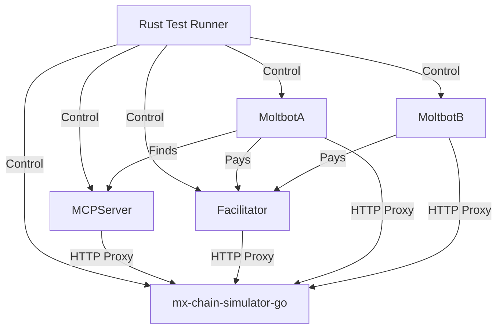

# Agentic Commerce Test Plan & Design

**Objective:** Detailed design for a "Chain Simulator" based test suite that orchestrates the entire MultiversX Agentic Commerce ecosystem without mocks.

## 1. Architecture: The "Orchestrator" Pattern

We will build a Rust-based orchestration suite that manages the lifecycle of all components.

### 1.1. Components (Real Instances)
1.  **Chain Simulator**: `mx-chain-simulator-go` (running on port 8085).
2.  **Smart Contract**: `mx-8004` (deployed on Simulator).
3.  **MCP Server**: `multiversx-mcp-server` (running as a Node.js process, port 3001).
4.  **Facilitator**: `x402-facilitator` (running as a Node.js process, port 3000).
5.  **Agent (Moltbot)**: `moltbot-starter-kit` (Node.js process).
6.  **Skills Bundle**: `multiversx-openclaw-skills` (Loaded by Moltbot).

### 1.2. Network Topology

---

## 2. Test Suites

### Suite A: Moltbot Lifecycle (Happy Paths)
*Focus: The journey of a single agent from birth to getting paid.*

| ID | Scenario | Steps | Expected Result |
| :--- | :--- | :--- | :--- |
| **ML-001** | **Registration & Discovery** | 1. Moltbot starts up. 2. Generates wallet (`wallet.pem`). 3. Calls `scripts/register.ts`. 4. MCP Server indexes `registerAgent` tx. 5. Test Runner queries MCP `get-agent-manifest`. | Agent is discoverable on MCP with correct Price/Token. |
| **ML-002** | **The "Get Paid" Flow (Passive)** | 1. Test Runner (Client) sends HTTP GET to Moltbot. 2. Moltbot returns 402 with Facilitator URL. 3. Client calls Facilitator `/verify` -> `/settle`. 4. Facilitator calls ChainSim. 5. Moltbot receives WebSocket event `payment_verified`. 6. Moltbot executes task. | Task completed, response returned to Client. |
| **ML-003** | **Reputation Loop** | 1. After ML-002, Moltbot calls `multiversx:prove` (Validation Registry). 2. Oracle (Test Runner) verifies job on-chain. 3. Client rates job via Reputation Registry. | Moltbot score increases. |

### Suite B: Multi-Agent Coordination (Happy Paths)
*Focus: Agents hiring Agents.*

| ID | Scenario | Steps | Expected Result |
| :--- | :--- | :--- | :--- |
| **MA-001** | **Task Delegation** | 1. **Agent A** (Buyer) receives a complex task. 2. Agent A queries MCP: "Who can do X?". 3. MCP returns **Agent B** (Seller). 4. Agent A hits Agent B's endpoint -> gets 402. 5. Agent A uses `multiversx:pay` skill. 6. Agent B works -> proves. 7. Agent A receives result. | A pays B using on-chain funds. B delivers result to A. B gets paid. |
| **MA-002** | **Chain of Command** | Agent A hires B, B hires C. | A pays B, B pays C. All proofs linked on-chain. |

### Suite C: Edge Cases & Failure Modes
*Focus: Robustness under pressure.*

| ID | Scenario | Condition | Expected Result |
| :--- | :--- | :--- | :--- |
| **EC-001** | **Insufficient Allowance** | Agent A tries to pay Agent B but has 0 USDC. | `multiversx:pay` fails gracefully with "Insufficient Funds". |
| **EC-002** | **Service Down** | Agent A tries to pay, but Facilitator is offline. | `multiversx:pay` retries or fails with "Payment Gateway Unavailable". |
| **EC-003** | **Double Spend Attempt** | Agent A tries to use the same Payment Nonce twice. | Facilitator rejects 2nd request. |
| **EC-004** | **Unverified Job Rating** | Client tries to rate Agent before `verifyJob` tx is mined. | Reputation Contract reverts. |
| **EC-005** | **Expired Offer** | Client tries to pay an Invoice that is > 1 hour old. | Facilitator rejects (Timestamp check). |

### Suite D: MCP Server Features (Comprehensive)
*Focus: Full coverage of all MCP tools and resources.*

| ID | Scenario | Tool | Expected Result |
| :--- | :--- | :--- | :--- |
| **MCP-001** | **Get Balance** | `get-balance` | EGLD balance matches ChainSim state. |
| **MCP-002** | **Query Account** | `query-account` | Nonce, Balance, CodeHash match ChainSim. |
| **MCP-003** | **Send EGLD** | `send-egld` | TxHash returned, Receiver balance increases. |
| **MCP-004** | **Send EGLD Bulk** | `send-egld-multiple` | Multiple receivers updated correctly. |
| **MCP-005** | **Issue Fungible** | `issue-fungible` | Token ID returned (e.g. `TEST-123456`). |
| **MCP-006** | **Issue SFT/NFT** | `issue-nft-collection` | Collection ID returned. |
| **MCP-007** | **Create NFT** | `create-nft` | NFT Nonce returned. |
| **MCP-008** | **Send Tokens** | `send-tokens` | ESDT/NFT transfer successful. |
| **MCP-009** | **Send Tokens Bulk** | `send-tokens-multiple` | Bulk ESDT transfer successful. |
| **MCP-010** | **Create Relayed V3** | `create-relayed-v3` | Returns a signed tx with `Relayer` field set. |
| **MCP-011** | **Track Transaction** | `track-transaction` | Polls until status is `success`. |
| **MCP-012** | **Search Products** | `search-products` | Returns mocked/indexed product data. |
| **MCP-013** | **Get Agent Pricing** | `get-agent-pricing` | Returns Price/Token from Registry for given Nonce. |

---

## 3. Implementation Plan Update

### New Tasks
1.  **Integrate `multiversx-openclaw-skills`**: Ensure the test runner can "inject" this bundle into the Moltbot instance (or point Moltbot to it).
2.  **Multi-Instance Support**: Update `ProcessManager` to support spawning `moltbot_a`, `moltbot_b` with different configurations (Ports, Wallets).
3.  **Client Simulator**: Implement a Rust HTTP client that mimics a user hitting the 402 endpoint, parsing the header, and talking to the Facilitator.
4.  **MCP Feature Tests**: Implement `suite_g_mcp_features.rs` to iterate through all MCP-0xx scenarios.

## 4. Verification
- `cargo test --test moltbot_lifecycle`
- `cargo test --test multi_agent`
- `cargo test --test mcp_features`
